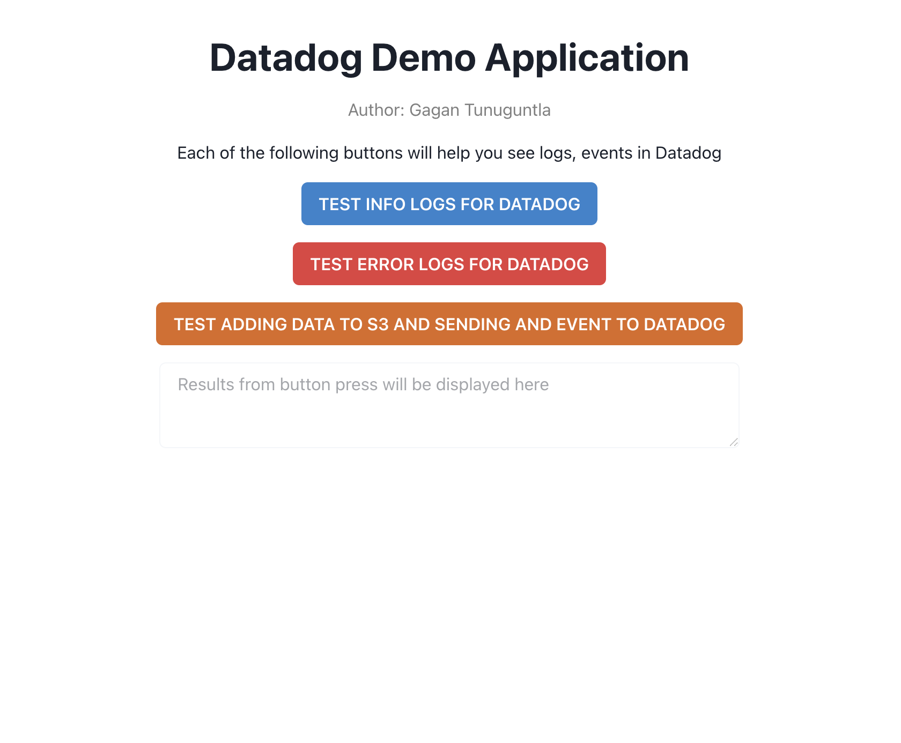
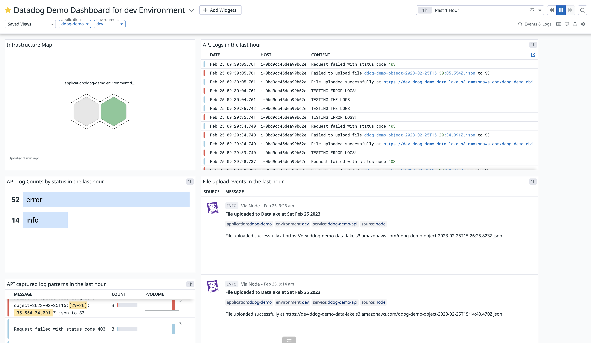
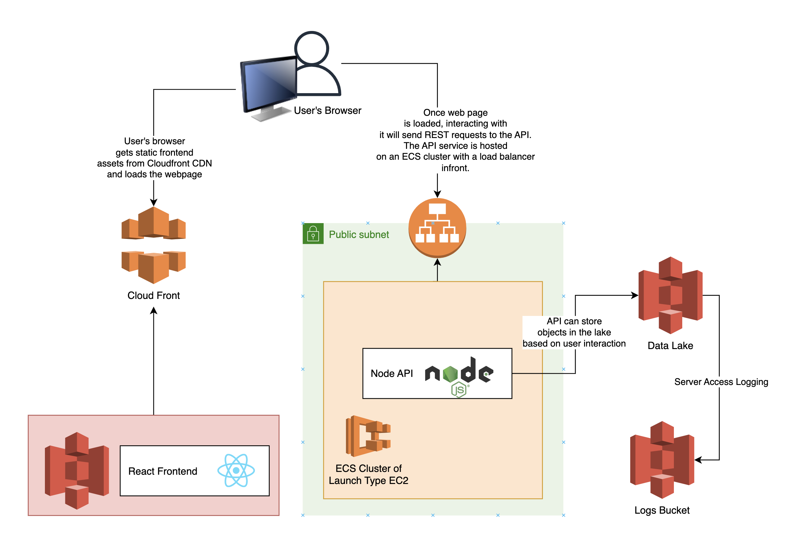
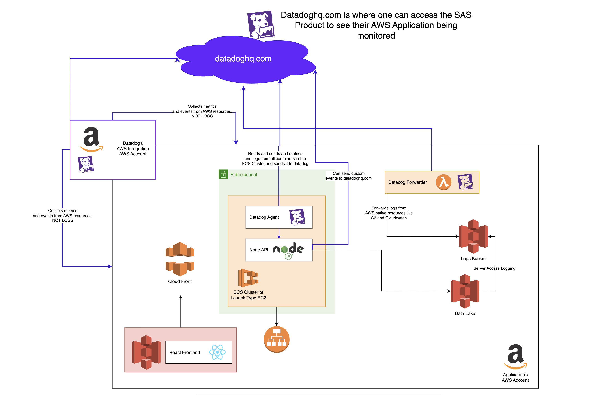

# Datadog Demo Application

Website is hosted on: https://dev-ddog-demo.gugz.net/

<p align="left">
  
  
</p>

The goal of this project is to showcase the integration of an application on AWS with Datadog. What is being built here is a simple web application, but is set up in a way that infrastructure resembles something closer to production.

The application itself is a REST api running on Nodejs in an ECS Cluster, and a react frontend hosted on S3 with a CloudFront distribution. There is also an S3 bucket representing a Data lake. The result is a simple web application that on user action can add data into a data storage system (a very common paradigm).

Our infrastructure is set up using Terraform, and the CI/CD is done using Github Actions. 

The following is the application's architecture diagram with its core components (the the integration with Datadog is not hidden):

<p align="left">
  
</p>

Under the hood of ECS is an autoscaling group of EC2 instances. This allows the application to scale if need be. The api also adds items to the Data lake. The Data lake a has server access logging enabled, which means that logs are sent to another S3 bucket.

The following is the application's architecture diagram shows the components integrated with Datadog:

<p align="left">
  
</p>

In order to get a comprehensive monitoring of the application and AWS environment, there are several flows through which events, logs, and metrics are collected and sent to Datadog:
- First is the AWS integration. This is an external AWS account owned by Datadog, that scans resources on the AWS account for events and metrics for resources.
- Second is the AWS Lambda Forwarder. This lambda function can forward cloud watch logs and S3 server access logs to Datadog. We are using it to forward logs from the S3 bucket that is used as a Data lake.
- Third is the Datadog Agent. This is installed on the ECS cluster running the application. It collects logs and metrics from the api and sends them to Datadog.
- Fourth is a simple request made to submit custom events to Datadog from the api service. This uses a API Key and Application Key to submit events to Datadog. We send events every time the api adds a new object to the Data lake.

## Folder Structure
```
.github/workflows - Github Actions configurations for CI/CD of the API and Client code
.infrastructure   - Terraform configurations for infrastructure (AWS and Datadog)
    aws/          - Application's AWS infrastructure is here
    datadog/      - Datatog related infrastructure is here (ECS Agent Task Definition, Lambda Forwarder, AWS Integration, Dashboard)
api/              - Source code Node based REST API (express js)
client/           - Source code React based frontend
env.template      - Template for .env file used for local development
```

## Getting Started

### Using the App

To understand how the application works, and how to see things happening in Datadog, please follow the instructions in the [Using the Application and Outlining its features](docs/using-the-app.md).

### Set Up the Infrastructure

The first thing needed to be done is provision and create all resources in AWS and integrations with Datadog. We do this through Terraform. The following steps will guide you through the process of setting up the infrastructure.

[Setting up the Infrastructure](docs/setting-up-infrastructure.md)

### Setting up the CI/CD

Once the infrastructure is provisioned the actual ui and api code need to be build and deployed. This is done through Github Actions. The following steps will guide you through the process of setting up the CI/CD with Github Actions.

[Setting up the CI/CD](docs/setting-up-ci-cd.md)

Once this is done application is ready to be used.

### Local Development

If you want to run things locally, for testing and feature development, you can do so by following the instructions in the [# Setting Up And Running The App On Your Local Machine](docs/setting-up-locally.md) document.


<!-- 
## Things I Should Add/Update to the Project
1. S3 bucket names should use the URL name, since this more unique, and will result in less conflicts especially if the same application is used by multiple people
2. Make sure to control the AWS IAM user's permissions to only allow the necessary permissions
3. Instructions to setting up different environments (dev, staging, prod)
    - I would use a different GitHub branch for every environment (dev, staging, prod)
    - I would use a different terraform workspace for every environment, where the VCS connection is set to the branch for that environment
    - This would involve some critical thinking especially at the enterprise scale
    - Parameterizing is not done everywhere yet
4. Instructions for adding Route 53 url and SSL certificate -->
