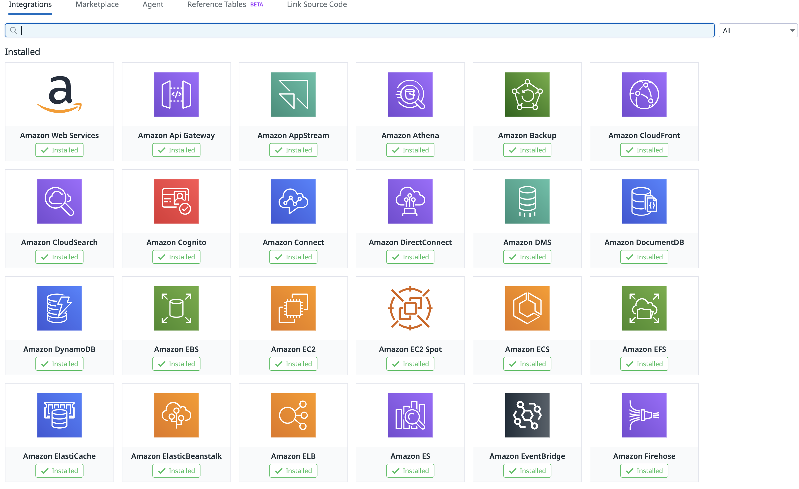
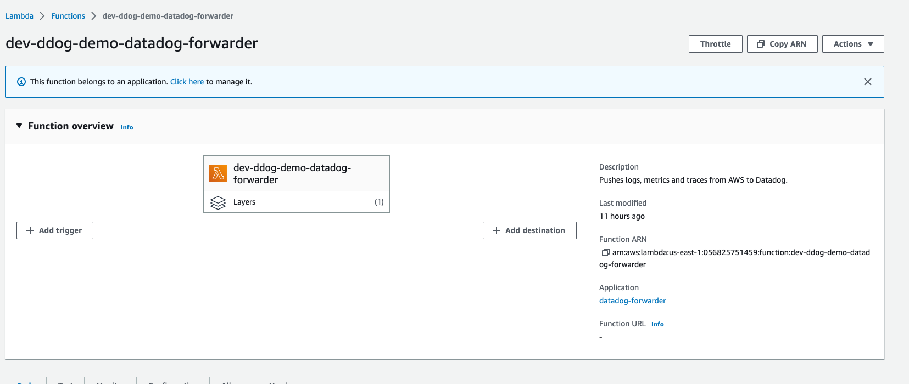
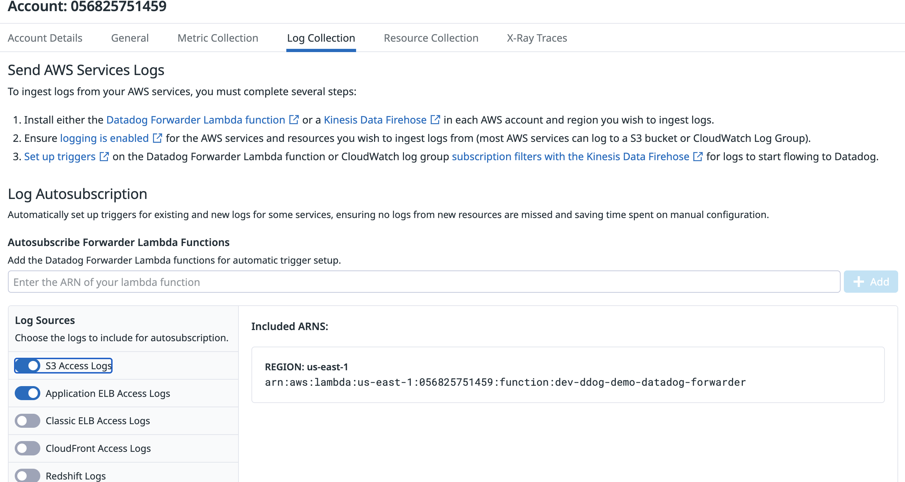

# Setting Up Launching the Application on AWS and Datadog

## STEP 1: Get Pre-Requisites
- Terraform Cloud 
- AWS Account
    - Create a new IAM user with programmatic access, and access keys
    - Instructions found here: https://docs.aws.amazon.com/IAM/latest/UserGuide/id_users_create.html
    - Instructions for creating Access Keys found here: https://docs.aws.amazon.com/IAM/latest/UserGuide/id_credentials_access-keys.html#Using_CreateAccessKey
    - Note: Make sure to save the Access Key ID and Secret Access Key
    - An AWS VPC ID you can deploy to
- Datadog Account
    - Have an API Key and APP Key
    - Instructions found here: https://docs.datadoghq.com/account_management/api-app-keys/
    - Note: Make sure to save the API Key and APP Key

## STEP 2: Setup Terraform Cloud
1. Create a new AWS IAM user with programmatic access to setup the infrastructure
2. Go to your Terraform Enterprise instance and create a new workspace (using the GitHub VCS provider)
3. After setting up set the following variables (as variable category **Environment Variable**):
    - `AWS_ACCESS_KEY_ID` - AWS Access Key ID for the IAM user
    - `AWS_SECRET_ACCESS_KEY` - AWS Secret Access Key for the IAM user
    - `AWS_DEFAULT_REGION` - AWS Region to deploy the infrastructure
3. After setting up set the following variables (as variable category **Terraform Variable**):
    - `DATADOG_API_KEY` - Datadog API Key
    - `DATADOG_APP_KEY` - Datadog APP Key
    - `AWS_ACCOUNT_ID` - AWS Account ID without dashes
    - `AWS_VPC_ID` - AWS VPC ID
    - `AWS_PUBLIC_SUBNET_ID` - AWS Subnet ID
    - `AWS_PRIVATE_SUBNET_ID` - AWS Subnet ID
    - `ENVIRONMENT` - (optional) Environment name, can help with tagging, set to "dev" by default
    - `APPLICATION_NAME` - (optional) Application name, can help with tagging, set to "ddog-demo" by default
3. In settings, set the Terraform Working Directory to `./.infrastructure`

## STEP 3: Run Terraform Plan and Apply, and Create your Resources
1. You should be able to run terraform plan from the workspace and see the resources that will be created
2. Run terraform apply to create the infrastructure
3. For reference this is where code from the terraform setup came from: https://docs.datadoghq.com/integrations/guide/aws-terraform-setup/
4. You can see your resources in the aws console. The names start with `[ENVIRONMENT]-[APPLICATION_NAME]*`, example: `dev-ddog-demo-*`
5. You can also search for them in the AWS Resource Groups service using the tags Application:[APPLICATION_NAME] and Environment:[ENVIRONMENT].

## STEP 4: Confirm AWS Integration is working in Datadog
1. Go to the Datadog AWS Integrations page: https://app.datadoghq.com/integrations
1. You should be able to see Amazon Web Services and bunch of other AWS integrations enabled

  

## STEP 5: Setup Datadog Forwarder
1. Most things have been set up and integrated with Datadog, but there is one step that needs to be done manually. First look for the AWS Lambda function named `[ENVIRONMENT]-[APPLICATION_NAME]-datadog-forwarder`, and copy the ARN of the function.
2. Then go to the Datadog AWS Integrations page: https://app.datadoghq.com/integrations/amazon-web-services
3. Click on the AWS Account you want to configure, and go to the "Log Collection" tab
4. Copy and paste the ARN to "Log Autosubscription". Enable at the least the following Log Sources, since these are components in the application:
    - S3 Access Logs
    - Application ELB Access Logs
    - CloudFront Access Logs

  

  

## STEP 5.5:
The application load balancer which hosts the api, and the cloudfront distribution which hosts the ui, both have Public URLs. But to make things consistent you may wan to consider getting a domain name and setting up a CNAME records in Route53 to point to the cloudfront distribution and load balancer. This is not required, but it is a nice to have as it will make things consistent naming wise.

## STEP 6: Move on to deployment
The infrastructure is now setup, and so is the connections to Datadog. Now we can deploy the ui and api. I suggest reading **Setting Up Continuous Deployment Via GitHub Actions** in the docs folder since that is the easiest way to deploy the application.
