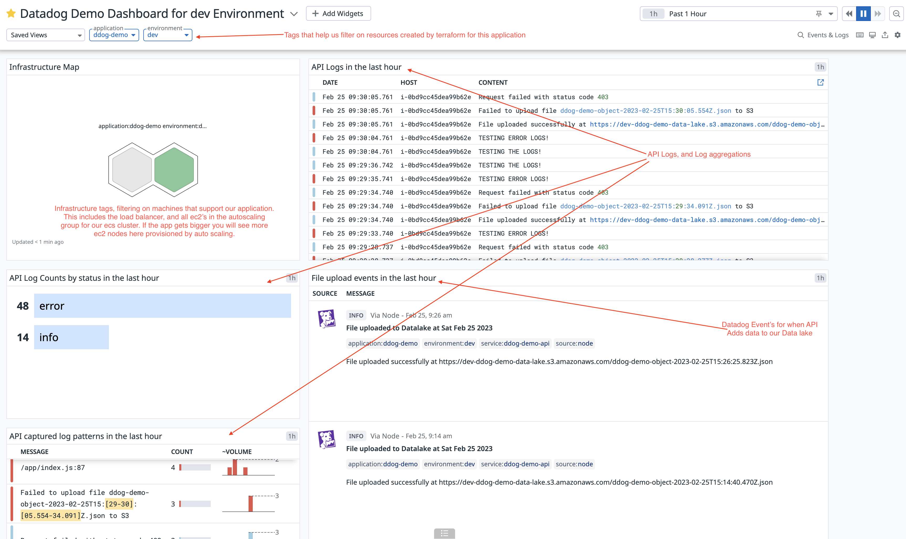
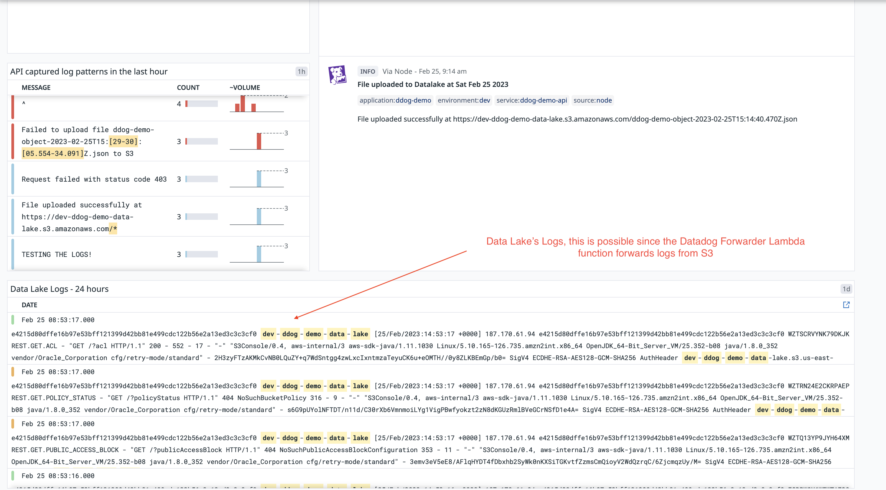
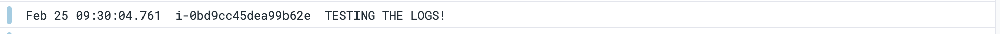
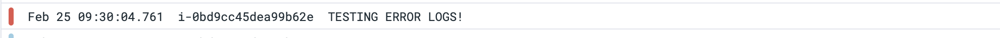
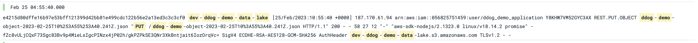
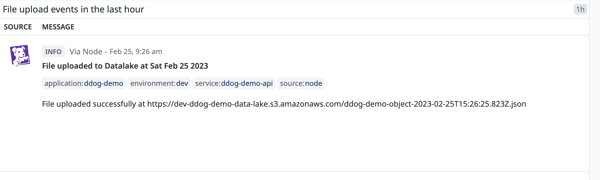

# Using the Application and Outlining its features

This page will explain some of the features of the application.

You can access the website here: http://dev-ddog-demo.gugz.net/

In addition you should have access to the Datadog Organization: Datadog Demo Env Candidate, belonging to the user: Gagan Tunuguntla

In this organization you should find a dashboard called: `Datadog Demo Dashboard for dev Environment`. This will be the best way to see the application in action.

  
  

## Dashboard Outlined

## Buttons on the Application and What they do

Clicking **"TEST INFO LOGS FOR DATADOG"** will send a call an api endpoint that will write and info level log. This will be picked up by the Datadog Agent in ECS and sent to Datadog.

Clicking **"TEST ERROR LOGS FOR DATADOG"** will send a call an api endpoint that will write and error level log. This will be picked up by the Datadog Agent in ECS and sent to Datadog.

Clicking **"TEST ADDING DATA TO S3 AND SENDING AND EVENT TO DATADOG"** will send a call an api endpoint that will write a file to the Data Lake S3 Bucket. Since this bucket has service logging the Datadog Forwarder Lambda Function can pick up the logs and send them to Datadog. In addition, the api will send an event to Datadog using the Datadog API.

- https://docs.datadoghq.com/logs/guide/forwarder/
- https://docs.datadoghq.com/api/latest/events/#post-an-event

^ S3 Service Logs

^ Datadog Event from api

## Beyond the Dashboard

The dashboard is just a centralized way for one to see how actions in the application are being picked up by Datadog. But you can use features like Logs, Infrastructure, and other Dashboards to see more details and digger broader and further.
